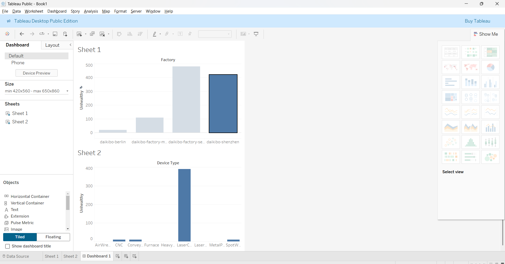

# Telemetry-Data-Analysis-Deloitte
# Data Analysis Project – Deloitte Virtual Internship

This repository documents the tasks and deliverables completed as part of the **Deloitte Australia Virtual Internship (Data Analytics Track)** on Forage.

## 📊 Project Overview

This project focuses on analyzing telemetry data and helping a client draw insights from it through data visualization and classification techniques. It simulates real-world scenarios a data analyst might face.

---

## ✅ Tasks Completed

### Task 1: Visualize Data with Tableau
- Explored telemetry data provided in JSON format.
- Cleaned and structured the data for visualization.
- Developed dashboards using **Tableau** to provide insights and trends.
- Dashboard screenshots are available in the `dashboard/` folder.



### Task 2: Classify Data in Excel
- Added a new column to classify data based on defined logic.
- Performed data cleaning, transformation, and organization.
- Final output saved in `Task_2.xlsx`.

---

## 📁 Project Structure

```
Telemetry-Data-Analysis-Deloitte/
├── daikibo-telemetry-data.json      # Raw telemetry data
├── Task_2.xlsx                      # Cleaned & structured data
├── dashboard/
│   ├── pic1.png                     # Tableau dashboard screenshot 1
│   └── pic2.png                     # Tableau dashboard screenshot 2
└── deloitte_certificate.pdf        # Internship certificate
```

---

## 🧠 Key Learnings

- Data Cleaning & Classification
- Excel Functions & Logic
- Tableau Dashboards
- JSON Parsing
- Drawing insights from large datasets

---

## 🏅 Certificate


---

## 📌 Note

This project was completed as part of a virtual internship experience and is intended for learning and demonstration purposes.
